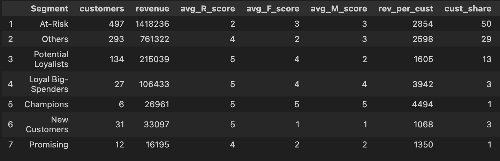
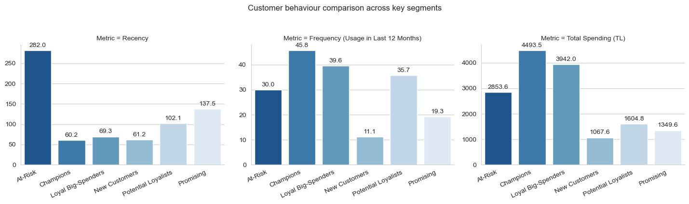
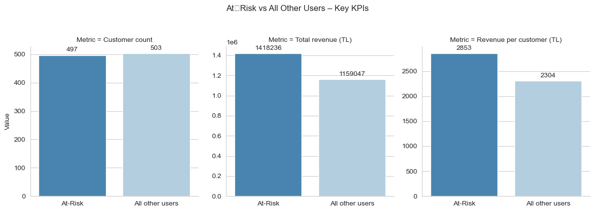

# 🚕 BiTaksi RFM Segmentation Project

## 1. Objective
Segment 1 000 customers by Recency-Frequency-Monetary (RFM) scoring, identify key segments, and design data-backed marketing actions.

## 2. Dataset
| Column | Description |
|--------|-------------|
| Customer ID | Unique rider ID |
| LastTransactionDate | Last trip date |
| Frequency (Usage in Last 12 Months) | Trips in past year |
| Total Spending (TL) | Spend in past year |

## 3. Method
1. **Calculate Recency** (assuming the most recent day as 31-Dec-2024)
2. **Assign R, F, M scores** (quintiles from 1-5)
3. **Create RFM_Score** (`R_Score``F_Score``M_Score`)
4. **Label segments**  
   *Champions, Loyal Big-Spenders, Potential Loyalists, Promising, New Customers, At-Risk*

## 4. Key Findings

| Segment             |       Share of Users | Share of Revenue | Average Spend per Rider (TL) | What it Means                                                   |
| ------------------- | -------------------: | ---------------: | ---------------------------: | --------------------------------------------------------------- |
| Champions           | **0.6 %** (6 riders) |          **1 %** |                   **4  494** | Very recent, very frequent, highest spend per rider.            |
| Loyal Big-Spenders  |           2.7 % (27) |              4 % |                       3  942 | Nearly as active as Champions; biggest single block to upgrade. |
| Potential Loyalists |         13.4 % (134) |              8 % |                       1  605 | Ride often but spend mid-range — strong upsell potential.       |
| Promising           |           1.2 % (12) |            0.6 % |                       1  350 | Early habit forming; need frequency boosts.                     |
| New Customers       |           3.1 % (31) |            1.3 % |                       1  068 | Recently acquired; activation window open.                      |
| At-Risk             |     **49.7 %** (497) |         **55 %** |                       2  854 | Historically valuable but inactive ≈ 9 months; urgent win-back. |

Totals: 1 000 riders, ₺ 2.58 M annual spend.

<small>(*Full KPI table in the notebook*)</small>

### Behaviour differences  

### Highest-value segment  
Champions (≤ 1 % of users)

### Churn-risk segment  
At-Risk users (nearly half of the dataset) haven’t ridden for approx. 9 months.

## 5. Marketing Recommendations (more on the notebook)
| Segment | Actions |
|---------|---------|
| **Champions / Loyal Big-Spenders** | VIP tier, milestone rewards, beta access |
| **At-Risk** | ₺200 “We Miss You” credit, win-back email, survey + credit |
| **Emerging (New + Promising + Potential)** | Welcome bonus, ride bundles, referral multipliers, geo-targeted deals (Kadıköy, İzmir, etc.) |

